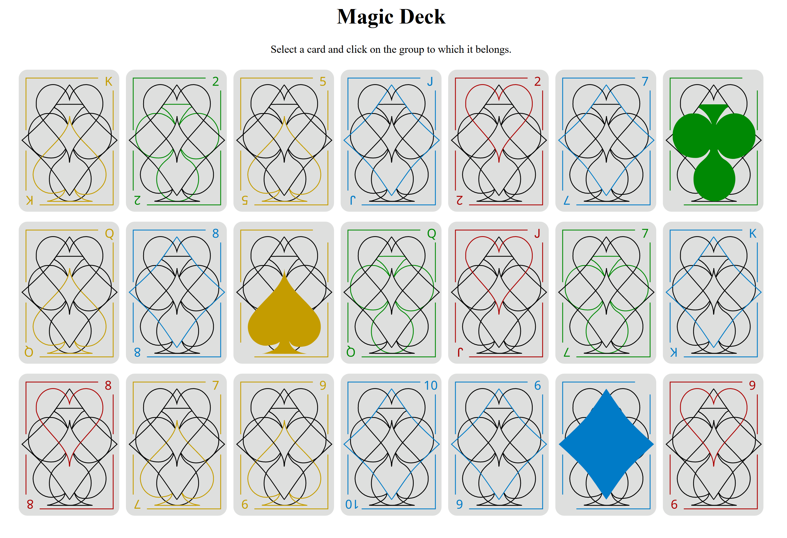

# MagicDeck

Application to perform the 21-card magic trick to guess the correct card after selecting the group three times.

As a kid, my dad blew my mind with this card trick that relied solely on trust in numbers, not deception. I loved it so much that years later, it inspired my first _free style_ programming project. It was a simple console application, displaying a bunch of numbers on the screen and waiting for the user to type the group number each time. I had a lot of fun writing it and it was a great challenge for a beginner. Recently, I decided to give it a makeover, spicing it up with cool visuals, a custom deck of cards and using basic HTML/CSS and TypeScript to make it even cooler.

